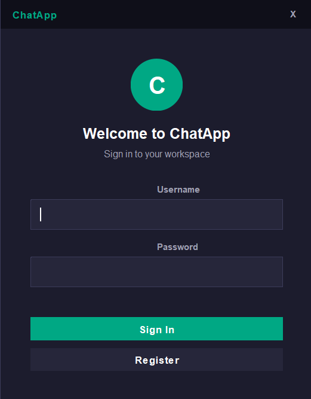
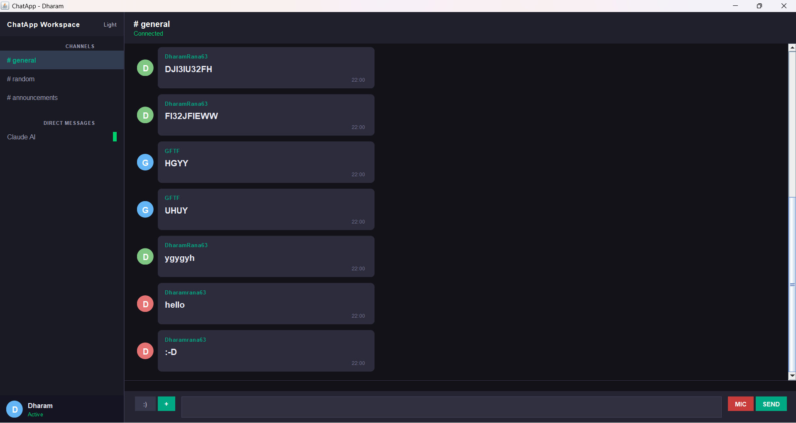
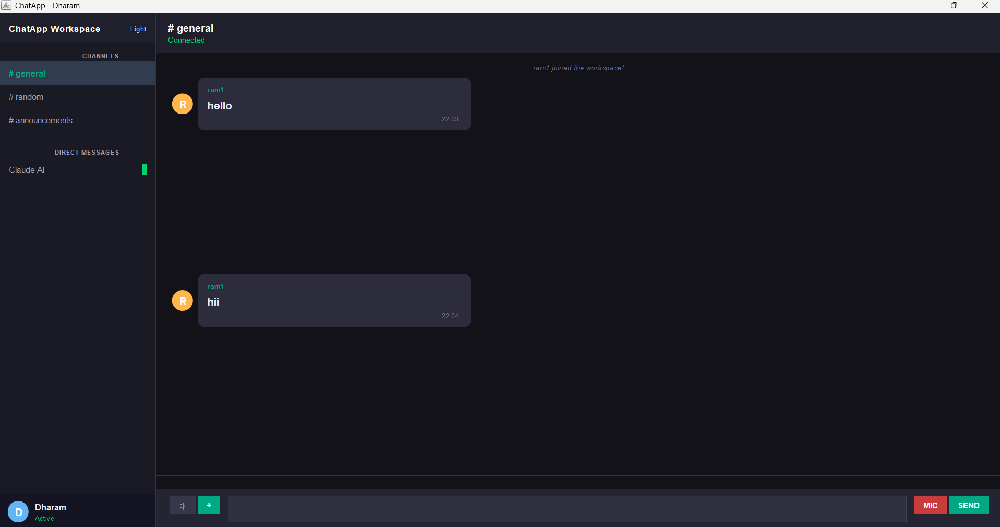

# ChatApp - Real-Time Chat Application

A full-featured real-time chat application built from scratch using Java Socket Programming, Multithreading, SQLite Database, and Java Swing GUI.

---

## Screenshots

### Login Screen


### Chat Window - User 1


### Chat Window - User 2


---

## Features

- Real-time messaging between multiple users
- User Authentication (Register / Login)
- SHA-256 password hashing for security
- Persistent chat history using SQLite database
- Private Direct Messaging between users
- Group Channels (#general, #random, #announcements)
- File Sharing
- Voice Messages
- Typing Indicators
- Dark / Light Mode toggle
- Desktop Notifications
- WhatsApp-style bubble chat UI
- Slack-style professional sidebar

---

## Tech Stack

| Technology | Usage |
|---|---|
| Java 17 | Core language |
| Java Socket Programming (TCP/IP) | Real-time networking |
| Multithreading | One thread per connected client |
| Java Swing | Desktop GUI |
| SQLite + JDBC | Persistent storage |
| SHA-256 | Password hashing |
| Java Sound API | Voice messages |

---

## Architecture

LoginDialog  ──auth──>  ChatServer
│
ChatGUI  ──socket──>  ClientHandler (Thread × N users)
│
┌──────────────┐
│  SQLite DB   │
│  - messages  │
│  - users     │
└──────────────┘

---

## Project Structure

ChatApp/
├── src/
│   └── com/chatapp/
│       ├── model/
│       │   ├── Message.java       # Serializable message object
│       │   └── User.java          # User model with password hashing
│       ├── server/
│       │   ├── ChatServer.java    # Main server, manages connections
│       │   ├── ClientHandler.java # Per-client thread, routes messages
│       │   ├── UserDatabase.java  # User auth storage
│       │   └── ChatDatabase.java  # Chat history storage (SQLite)
│       ├── client/
│       │   ├── LoginDialog.java   # Login / Register screen
│       │   ├── ChatGUI.java       # Main chat window (Swing)
│       │   └── ChatClient.java    # Client socket logic
│       └── util/
│           └── FileUtils.java     # File read/write helpers
├── lib/
│   └── sqlite-jdbc.jar            # SQLite JDBC driver
├── uploads/                       # Received files saved here
├── .gitignore
└── README.md

---

## How to Run

### Prerequisites
- JDK 17 or higher
- SQLite JDBC JAR placed in `lib/` folder
  - Download from: https://github.com/xerial/sqlite-jdbc/releases

### 1. Compile

```powershell
javac -encoding UTF-8 -cp "lib\sqlite-jdbc.jar" -d out src/com/chatapp/model/Message.java src/com/chatapp/model/User.java src/com/chatapp/util/FileUtils.java src/com/chatapp/server/UserDatabase.java src/com/chatapp/server/ChatDatabase.java src/com/chatapp/server/ChatServer.java src/com/chatapp/server/ClientHandler.java src/com/chatapp/client/ChatClient.java src/com/chatapp/client/LoginDialog.java src/com/chatapp/client/ChatGUI.java
```

### 2. Run the Server

```powershell
java -cp "out;lib\sqlite-jdbc.jar" com.chatapp.server.ChatServer
```

### 3. Run the Client

Open a new terminal:

```powershell
java -cp "out;lib\sqlite-jdbc.jar" com.chatapp.client.LoginDialog
```

Run multiple clients for multiple users — each in a new terminal.

---

## How to Use

| Action | How |
|---|---|
| Register | Open client, click Register, enter username + password |
| Login | Enter credentials and click Sign In |
| Send message | Type in input box and press Enter or click Send |
| Private message | Click a username in sidebar or type `/pm username message` |
| Join channel | Click channel in sidebar or type `/join channelname` |
| Send file | Click the `+` button |
| Voice message | Click `MIC` button to record, click `STOP` to send |
| See online users | Listed in left sidebar |
| Toggle theme | Click Light/Dark button in sidebar |
| View commands | Type `/help` in chat |

### Commands

/users                  List online users
/pm <user> <message>    Send private message
/channels               List all channels
/join <channel>         Join a channel
/leave <channel>        Leave a channel
/gc <channel> <msg>     Send group message
/history <channel>      Load chat history
/quit                   Disconnect

---

## Security

- Passwords are never stored in plain text
- SHA-256 hashing applied before saving to database
- Each client runs in isolated thread
- Authentication required before accessing chat

---

## What I Learned

- TCP/IP socket programming in Java
- Managing concurrent clients with multithreading
- Designing a client-server architecture
- Database integration with JDBC
- Building desktop GUIs with Java Swing
- Serialization for sending objects over network
- Secure password storage techniques

---

## Author

Dharam Rana
B.Tech Computer Science Engineering — 4th Year
GitHub: https://github.com/Dharamrana

---

## License

MIT License — free to use and modify.